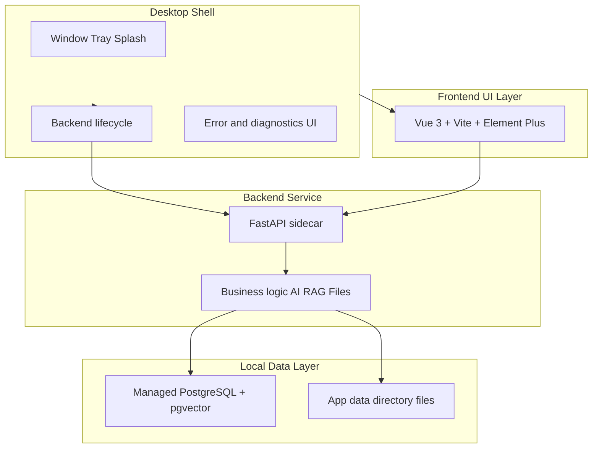

# 目标架构：桌面一体化（Desktop Target）

本文描述 **产品模式** 下的目标技术分层。当前仓库仍以 **开发模式**（浏览器 + 独立后端进程 + 外部/本地 Postgres）实现业务；见 [runtime_modes.md](runtime_modes.md)。

## 1. 分层总览

| 层 | 职责 | 技术取向（当前/目标） |
|----|------|------------------------|
| **Desktop shell** | 窗口、安装与更新入口、启动画面、托盘、**启动/停止本地后端**、与本机 API 通信、向用户展示启动失败原因 | **优先评估 Tauri 2**；备选 Electron；见 [packaging_strategy.md](packaging_strategy.md) |
| **Frontend UI** | 全部业务界面；不承担权威业务规则 | 保留现有 Vue 3 + TS + Vite + Element Plus；由 **WebView 或内嵌浏览器** 加载构建产物 |
| **Backend service** | REST/API、认证、规则、AI、RAG、文件、迁移、Bootstrap 编排（随阶段落地） | 保留 FastAPI；目标为 **sidecar 可执行文件**（如 PyInstaller 产物），由壳启动 |
| **Local data** | 业务数据、向量检索 | **保留 PostgreSQL + pgvector**；产品模式下由应用 **托管或自动引导** 本地实例，用户不管理集群 |

## 2. 新增系统能力（与代码实现阶段对应）

| 模块 | 职责概要 |
|------|----------|
| **App Bootstrap Manager** | 首次运行检测、应用数据目录、配置生成、库存在性、自动迁移、初始账户、bootstrap seed、健康检查、向 shell 汇报就绪状态 |
| **Runtime Mode Manager** | `development` / `desktop` / `demo` / `future_cloud`；切换 DB 来源、上传目录、是否允许演示 seed、是否暴露调试信息（见 [runtime_modes.md](runtime_modes.md)） |
| **Database Lifecycle Manager** | 集群/数据目录、启停、建库、扩展（如 `vector`）、迁移、备份恢复、健康与诊断（见 [database_lifecycle.md](database_lifecycle.md)） |
| **Packaging layer** | 前端静态资源、后端 sidecar、可选 DB 运行时、安装包与版本写入（见 [packaging_strategy.md](packaging_strategy.md)） |
| **Recovery and diagnostics** | 启动失败原因、日志导出、诊断包、「修复数据库」入口（产品化阶段加强） |

以上模块在 **D1–D4** 逐步实现；D0 仅完成文档与接口级设计共识。

**D2（已实现事实）**：最小 **Tauri 2** 壳位于 `frontend/src-tauri`；WebView 首屏加载路由 **`/desktop-launch`**，消费 D1 的 **`GET /health`** 后再进入既有 Vue 应用；不替代「浏览器 + `npm run dev`」的开发工作流。

**D3（已实现事实，Windows）**：壳通过 **`tauri-plugin-shell`** + **`bundle.externalBin`** 启动 **PyInstaller** 冻结的 **`intellioffice-backend`** sidecar；子进程环境含 **`APP_RUNTIME_MODE=desktop`**；默认 **`127.0.0.1:17888`**；前端经 Tauri 命令 **`get_desktop_config`** 与 **`resolveDesktopHealthContext()`** 对齐 health/API 基址；**release** 构建默认托管 sidecar，**debug** 默认不托管（可用 **`INTELLIOFFICE_MANAGE_SIDECAR=1`** 显式打开）。详见 [packaging_strategy.md](packaging_strategy.md) 与 [testing.md](testing.md) D3。

**D4（已实现事实，PostgreSQL + Alembic）**：**Database Lifecycle Manager**（`backend/app/core/database_lifecycle.py`）在 **`desktop` / `demo` / `future_cloud`** 下于启动阶段 **自动**执行 **`alembic upgrade head`**（后台线程）；`/health` 暴露 **`database_lifecycle_phase`** 与迁移版本字段；**不**包含 Postgres 安装包或 `initdb`。详见 [database_lifecycle.md](database_lifecycle.md) 与 [testing.md](testing.md) D4。

## 3. 开发模式 vs 产品模式

| 维度 | 开发模式（Dev） | 产品模式（Desktop product） |
|------|-----------------|-----------------------------|
| 数据库 | 外部或 Docker Postgres；开发者自管 `DATABASE_URL` | 应用托管或自动初始化；用户 **不** 配置连接串 |
| 启动 | 手动 `uvicorn`、`npm run dev` 等 | **单入口**；壳拉起后端与 UI |
| 迁移/seed | 可手动 Alembic、手动脚本 | 由 Bootstrap / Lifecycle **自动或引导完成** |
| pgAdmin / Docker | **允许且常见** | **不要求**最终用户安装或使用 |
| 调试 | 完整日志、热重载 | 受控诊断界面与日志导出 |

## 4. 相关文档

- [product_vision.md](product_vision.md)  
- [roadmap_desktop_transition.md](roadmap_desktop_transition.md)  
- [migration_from_web_to_desktop.md](migration_from_web_to_desktop.md)  
