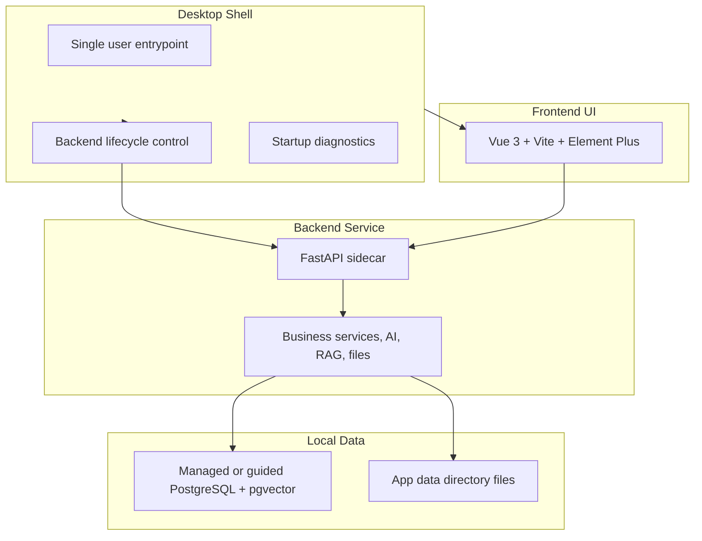

# Desktop Target Architecture

**Status:** current on 2026-05-30. This document describes the long-term desktop/local-first target architecture for intelliOffice PartnerOS. It does not change the current D8 staging handoff state and does not replace the D8 strict staging evidence process.

## Current Position

PartnerOS currently runs as a Vue/Vite frontend with a FastAPI backend and PostgreSQL/pgvector data store. The repository is locally ready for D8 staging handoff when `project_execution_status.py` reports `READY_FOR_STAGING_HANDOFF`.

That state means local docs, gates, runbooks, and checks agree. It does not mean `STAGING_VALIDATED`. Strict staging evidence still requires real staging values supplied outside the repository.

## Target Layers



| Layer | Responsibility | Current / target direction |
|---|---|---|
| Desktop shell | Window, launch, lifecycle, startup errors, diagnostics, and eventual packaging entrypoint | Tauri 2 path exists; desktop packaging remains a product path, not the current D8 staging proof |
| Frontend UI | Operator workflows, dashboards, forms, and bridge previews | Keep Vue 3 / Vite / Element Plus; browser-first development remains normal |
| Backend service | API, auth, business rules, AI/RAG, files, migrations, runtime health | Keep FastAPI; sidecar packaging may wrap the backend for desktop product mode |
| Local data | Business data, vectors, files, and local diagnostics | Keep PostgreSQL + pgvector; final users must not manage database tooling manually |

## Runtime Modes

Runtime mode describes how the backend is started and what operational assumptions apply:

- `development`: browser-first local development with explicit backend and frontend processes.
- `desktop`: desktop shell or sidecar-managed runtime.
- `demo`: controlled local demo runtime with seeded data rules.
- `future_cloud`: future deployment mode placeholder; not a license to deploy or modify `service.intelli-opus.com` from this repository.

See [Runtime Modes](runtime_modes.md) and [Database Lifecycle](database_lifecycle.md) for the current implementation details.

## Product-Mode Goals

The desktop/local-first product path should eventually provide:

- a single user-facing launch point
- guided local configuration
- backend lifecycle and health reporting
- controlled diagnostics and log export
- database migration orchestration
- safe file storage conventions
- a clear distinction between internal PartnerOS workflows and public customer portal bridge APIs

No final-user path may require users to run PostgreSQL, pgAdmin, Docker, Alembic, or raw SQL.

## Current D8 Boundary

Current D8 work is staging handoff and production-coordination readiness. It is not desktop packaging completion.

D8 validation uses local port `8014` for D7.6+/D8 checks:

```powershell
cd backend
$env:BACKEND_BASE_URL="http://127.0.0.1:8014"
python scripts/project_execution_chain_gate_check.py
python scripts/project_execution_chain_check.py
python scripts/project_execution_status.py
```

Strict staging evidence is separate and uses the real staging `BACKEND_BASE_URL`, `SERVICE_PORTAL_PARTNEROS_TOKEN`, and `SERVICE_PORTAL_ORIGIN`.

## Portal Boundary

The public customer-facing portal remains `service.intelli-opus.com`. PartnerOS exposes carefully whitelisted bridge APIs. This repository must not edit nginx, cloud upstreams, service portal deployment, customer notifications, supplier notifications, carrier APIs, or webhook integrations.

Customer-visible bridge fields must remain explicit allowlists and must not expose internal costs, margins, supplier private notes, backend storage paths, storage keys, raw response bodies, or tokens.

## Manual-Only Business Safety

Desktop packaging must not change business semantics:

- customer confirmations remain operator-recorded
- supplier confirmations remain operator-recorded
- production milestones remain operator-recorded
- shipment plans remain operator-recorded
- shipment plans do not automatically change order status to shipped/delivered
- feedback intake remains human-reviewed and does not auto-reply

## Related Documents

- [Product Vision](product_vision.md)
- [Project Reorientation Summary](project_reorientation_summary.md)
- [Desktop Transition Roadmap](roadmap_desktop_transition.md)
- [Developer Guide](dev_guide.md)
- [Testing Guide](testing.md)
- [Packaging Strategy](packaging_strategy.md)
- [Open Desktop Questions](open_questions_desktop.md)
