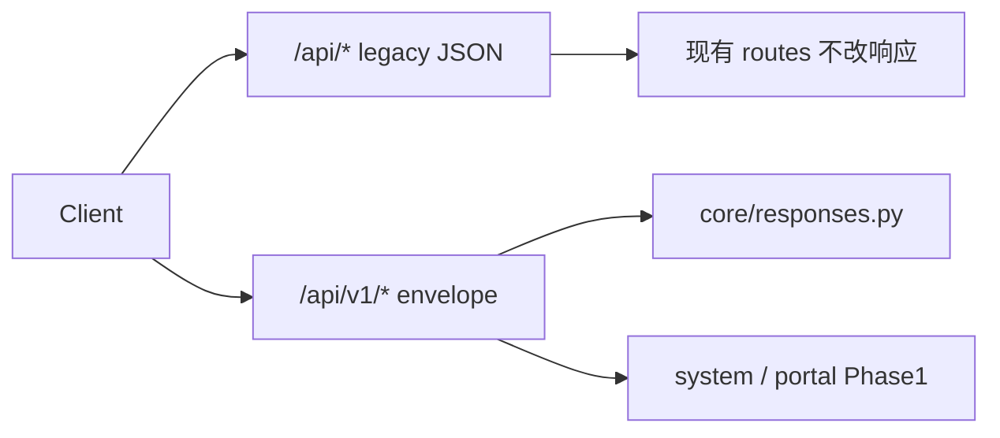

# Integrated Backend Standards（IE / intelliOffice）

本文档定义 **未来统一 Portal / 多项目部署** 下的后端开发标准，并与 **当前仓库（D0–D5.2）** 的真实结构对齐。  
**双轨策略**：旧 `/api/*` 保持不变；新能力走 **`/api/v1/*` + 统一 envelope**。

相关： [manual_a_domain_test_plan.md](manual_a_domain_test_plan.md) · [runtime_modes.md](runtime_modes.md) · [database_lifecycle.md](database_lifecycle.md)

---

## 1. 开发前检查模板（每次新功能必答）

```text
功能名称：
业务目标：
Domain：（CRM | LeadIntelligence | Quote | Order | Production | Shipment | Task | File | System | Integration）
新增/修改 API：（是否 /api/v1；是否 envelope）
新增/修改数据库表：（Alembic revision ID）
权限变化：（角色 / 路由 dependency）
环境变量变化：（须同步 .env.example）
Portal 集成影响：（manifest modules/capabilities/readiness）
Audit：（是否 log_activity / 未来 audit_logs）
测试计划：（schema / service / API / health）
风险：
```

---

## 2. 当前仓库 vs 目标架构映射

| 目标 | 当前仓库 | Phase / 策略 |
|------|----------|--------------|
| `/api/v1/*` | 已有 `/api/*` 无版本 | **双轨**；Phase 1 起 v1 仅系统接口 |
| Envelope `{ ok, data, meta }` | 旧接口直接返回 Pydantic | **仅 v1**；见 [`core/responses.py`](../backend/app/core/responses.py) |
| `GET /health` | D1/D4 字段（bootstrap、DLM） | **保持兼容**，不删字段 |
| `readiness` / `doctor` / `manifest` | Phase 1 已加 v1 | 复用 DLM + Alembic |
| Domain services | 部分已有（`a_domain/`, `enrichment/`） | 新模块按域加 service，旧 route 渐进抽离 |
| Repository 层 | 无独立 repositories/ | Phase 2+ 可选引入 |
| Quote | 现名 RFQ / Quotation | **文档映射**，不强制 rename |
| Audit | `ActivityLog` + `log_activity` | 扩展词汇；长期可对齐 `audit_logs` |
| Redis / Worker | 未接入 | readiness **warning**，不阻塞 MVP |
| 软删除 | `is_active` | 新表可用 `deleted_at`；旧表 migration 加列 |

---

## 3. 双轨 API 策略



**原则**

1. **禁止 Big-bang**：不得一次性改所有旧路由或前端调用。
2. 新接口 **必须** 在 `/api/v1/{domain}` 下。
3. 旧 `/api/companies` 等 **长期保留**，直至前端/Portal 迁移完成并显式 deprecate。
4. v1 错误使用 [`core/errors.py`](../backend/app/core/errors.py) + envelope；旧接口仍用 FastAPI `HTTPException` 等既有行为。

---

## 4. v1 Envelope 标准

### 成功

```json
{
  "ok": true,
  "data": {},
  "meta": {
    "request_id": "uuid",
    "timestamp": "2026-05-22T12:00:00+00:00",
    "pagination": null
  }
}
```

### 失败

```json
{
  "ok": false,
  "error": {
    "code": "NOT_FOUND",
    "message": "Human readable message.",
    "details": {},
    "request_id": "uuid"
  },
  "meta": {
    "request_id": "uuid",
    "timestamp": "..."
  }
}
```

- `request_id`：由 [`RequestIdMiddleware`](../backend/app/core/request_id.py) 生成或接受 `X-Request-ID`。
- 实现：[`success_envelope` / `error_envelope`](../backend/app/core/responses.py)。

---

## 5. 系统级接口（Phase 1 已落地）

| 方法 | 路径 | 说明 |
|------|------|------|
| GET | `/health` | **遗留契约**；桌面壳与 DLM 依赖，字段不可删 |
| GET | `/api/v1/system/readiness` | DB + Alembic head；redis/storage/worker 可 false + warnings |
| GET | `/api/v1/system/doctor` | 脱敏诊断（无 DATABASE_URL 密码、无 SECRET_KEY 明文） |
| GET | `/api/v1/portal/manifest` | Portal 服务描述、modules、capabilities、api_version |

实现：[`app/services/system/platform.py`](../backend/app/services/system/platform.py) · 路由 [`app/api/v1/routes/`](../backend/app/api/v1/routes/)

### readiness 语义（MVP）

- `ok`（data 内）：`database_ready && database_at_head && auth_ready`
- `redis_ready` / `worker_ready`：Phase 1 恒 false，写入 `warnings`
- `storage_ready`：本地 `UPLOAD_DIR` / `LOCAL_STORAGE_PATH` 可写则 true

### doctor 脱敏

- `database.database_url_masked` 使用 [`mask_database_url`](../backend/app/core/db_url_utils.py)
- 不输出 `OPENAI_API_KEY`、完整 JWT secret

---

## 6. 旧 API 兼容原则

- `/health` 响应字段列表以 [`test_health.py`](../backend/tests/test_health.py) 为契约。
- 旧 `/api/*` **不** 包裹 envelope、**不** 强制 `request_id`（middleware 仍会加响应头）。
- D5.2 Enrichment、A 域 scoring、RFQ/Order **业务逻辑与路径** 不在未排期时改动。

---

## 7. D0–D5.2 不破坏原则

| 阶段 | 保护内容 |
|------|----------|
| D1–D4 | `/health`、DLM、`APP_RUNTIME_MODE` |
| D5 / D5.1 | `intelligence_score`、`market_fit_segments` 互斥规则 |
| D5.2 | Enrichment run/review/apply；`PUBLIC_ENRICHMENT_ENABLED` |
| 桌面 | Tauri `/desktop-launch` 仍消费 legacy `/health` |

集成化改造 **additive only**：加 v1、加文档、加配置项；不删旧路由。

---

## 8. Domain 边界（摘要）

| Domain | 负责 | 禁止混入 |
|--------|------|----------|
| CRM | company, contact, interaction | 报价计算、生产排程 |
| LeadIntelligence | scoring, segments, enrichment 建议 | 静默写正式评分 |
| Quote/RFQ | 现 RFQ/Quotation 工作区 | 物流费用硬编码在前端 |
| Order / Production / Shipment | 订单与里程碑、运输记录 | CRM 主数据规则 |
| System | health, readiness, doctor, manifest | 业务 CRUD |
| Task / File | 任务、附件 | 跨域事务未封装 |

---

## 9. 环境变量（集成预留）

Phase 1 起建议在 `.env` / [`.env.example`](../backend/.env.example) 中维护：

| 变量 | 用途 |
|------|------|
| `APP_NAME` | 服务标识 |
| `APP_RUNTIME_MODE` | development / desktop / demo / future_cloud |
| `PUBLIC_BASE_URL` | manifest URL 拼接 |
| `PORTAL_INTEGRATION_ENABLED` | Portal 开关 |
| `REDIS_URL` | 预留；未配置则 readiness warning |
| `STORAGE_BACKEND` / `LOCAL_STORAGE_PATH` | 文件存储 |
| `DATABASE_URL` | PostgreSQL（无默认口令） |
| `SECRET_KEY` / `JWT_SECRET` | JWT |

---

## 10. 测试要求

每个 Phase 至少：

1. v1 envelope 结构测试（[`test_api_v1_system.py`](../backend/tests/test_api_v1_system.py)）
2. `/health` 遗留字段测试
3. doctor 不泄露敏感信息
4. 全量 `pytest` 通过

---

## 11. Phase 路线图（不在本轮实现）

| Phase | 内容 |
|-------|------|
| **1（当前）** | readiness / doctor / manifest + envelope 基础设施 |
| **2** | v1 CRM 资源（companies/contacts/leads）envelope + service 抽离 |
| **3** | 权限矩阵 `core/permissions.py`、audit 扩展 |
| **4** | integration events、Redis 真 ping、worker |
| **5** | Portal SSO 适配层 |

**不进入**：D5.3 Interaction Memory、D6 产品化、RFQ 域 Big-bang 重构。

---

## 12. Partner 平级

intelliOffice 为平台品牌；HOSUN、JOOBOO 及未来工厂均为 **平级** `manufacturing_partners` 数据行。manifest、评分、enrichment **不得** 硬编码或默认优待任一厂牌。
