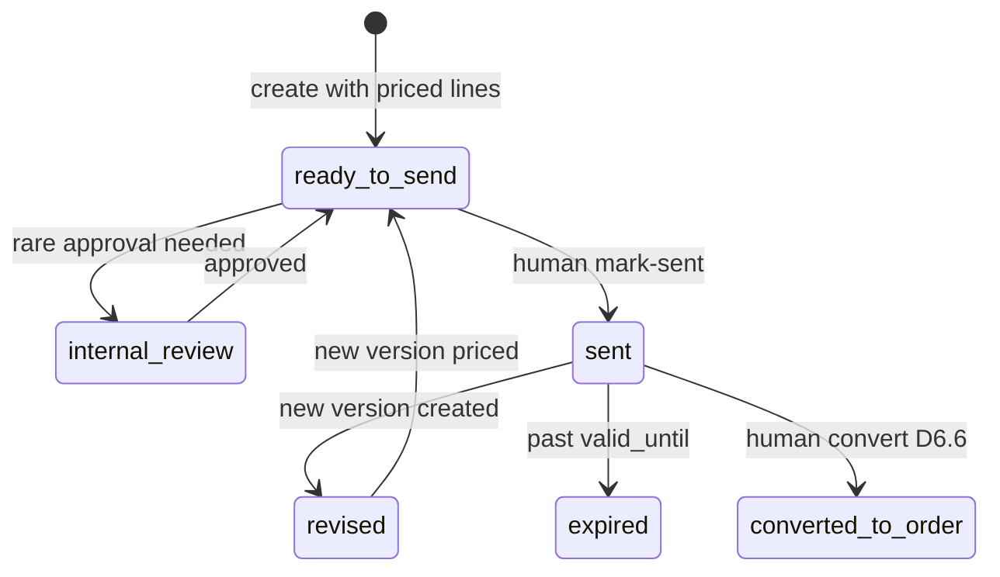

# D6.1 Quote Schema & API Design Review

**Status:** Design review complete · **Not implemented** · **Date:** 2026-05-23  
**Phase:** 2 · **Stage:** D6.1  
**Prerequisite:** D5 closed · Quote Input Contract available

---

## Business Decisions

Summary of confirmed business rules for Phase 2 Customer Quote:

| # | Rule |
|---|---|
| 1 | intelliOffice is platform/service provider — **not** a single-factory brand on customer PDF |
| 2 | HOSUN, JOOBOO, 重庆汇聚, future partners are **equal** partners |
| 3 | One quote may contain lines from **multiple partners** |
| 4 | Every line binds `partner_id`, product name, category, SKU or temp SKU |
| 5 | **No price-less quote** — if pricing unavailable, stay in D5 Pre-Quote / product catalog only |
| 6 | Price from catalog / cost model / price tier / manual / confirmed pricing engine — **never AI** |
| 7 | Default currency **USD**; RMB costs converted via daily FX snapshot on quote |
| 8 | Incoterms: **EXW / FOB / CIF / DDP** (MVP focuses FOB + DDP) |
| 9 | Quote visible to **internal sales**, **customer** (PDF/view), **partner** (filtered view) — different field visibility |
| 10 | **Human** mark-sent — no auto email/LinkedIn |
| 11 | **Human** convert-to-order — no auto conversion |
| 12 | Multiple **quote versions**: partner-specific, combined, revised |
| 13 | User may **multi-select products** to generate combined quote |
| 14 | Approval: semi-auto; MVP reserves `internal_review` status, no complex workflow |
| 15 | Quote created from **Lead + Quote Input Contract** snapshot |
| 16 | Existing `quotations` table = **Partner Quotation** (RFQ supplier quotes) — unchanged |

### Terminology

| Name | Table / API | Meaning |
|---|---|---|
| **Customer Quote** | `quotes` (new) | Formal quote to customer |
| **Partner Quotation** | `quotations` (existing) | Supplier quote within RFQ workflow |
| **Partner** | `manufacturing_partners` (existing) | Factory/brand — all equal |

---

## Excel Pricing Model Extraction

The operator Excel workbook logic must be **abstracted into DB + pricing service** — not embedded as spreadsheet formulas.

### 1. Cost Model sheet

| Excel column | System mapping |
|---|---|
| Product Name | `product_catalog.product_name` |
| RMB material cost | `product_cost_models.material_cost_rmb` |
| weight | `product_cost_models.weight_kg` |
| ocean freight unit price | `product_cost_models.ocean_freight_unit_usd_per_kg` |
| exchange rate | `fx_rates` snapshot on quote line |
| domestic profit percentage | `product_cost_models.domestic_profit_pct` |
| transportation cost RMB | `product_cost_models.transportation_cost_rmb` |
| freight cost USD | computed: weight × ocean freight unit |
| FOB cost USD | computed: (material RMB + transport RMB) / FX + domestic margin component |
| DDP cost USD | computed: FOB cost USD + freight USD + duty estimate (if configured) |

**Formula abstraction (pricing engine, not Excel):**

```
material_usd = material_cost_rmb / fx_rate_usd_cny
transport_usd = transportation_cost_rmb / fx_rate_usd_cny
freight_usd = weight_kg * ocean_freight_unit_usd_per_kg
fob_cost_usd = material_usd + transport_usd + domestic_profit_component
ddp_cost_usd = fob_cost_usd + freight_usd + ddp_surcharge (if any)
```

### 2. Price List sheet

| Excel column | System mapping |
|---|---|
| product | `product_catalog_id` |
| MinQty / MaxQty | `product_price_tiers.min_qty`, `max_qty` |
| FOB | `product_price_tiers.fob_unit_price_usd` |
| DDP | `product_price_tiers.ddp_unit_price_usd` |
| FOB adjustment | `product_price_tiers.fob_adjustment_usd` |
| DDP adjustment | `product_price_tiers.ddp_adjustment_usd` |

**Quantity tiers (standard bands):**

| Tier | MinQty | MaxQty |
|---|---|---|
| T1 | 1 | 49 |
| T2 | 50 | 99 |
| T3 | 100 | 299 |
| T4 | 300 | 499 |
| T5 | 500 | NULL (∞) |

Tier selection: `quantity` falls into band → apply tier row for product + incoterm.

Final tier price:

```
base = fob_unit_price_usd OR ddp_unit_price_usd  (by incoterm)
adjusted = base + fob_adjustment_usd OR ddp_adjustment_usd
```

### 3. Margin Strategy sheet (利润倍率)

| Strategy (Excel) | Code | Purpose |
|---|---|---|
| 引流 | `traffic` | Lower margin — acquisition |
| 销量 | `volume` | Standard volume margin |
| 利润 | `profit` | Higher margin |

Stored in `margin_strategy_tiers`: `(strategy_code, min_qty, max_qty, multiplier)`.

Applied **after** tier base price:

```
base_unit_price_usd = tier_price OR cost_model_price
strategy_adjusted = base_unit_price_usd * multiplier
```

### 4. Quote template sheet

| Excel field | System field |
|---|---|
| Quote number | `quotes.quote_number` |
| Quote date | `quotes.quote_date` |
| Valid For / Valid Till | `quotes.valid_until` (default +21 days) |
| Bill To | `quotes.bill_to_*` |
| Ship To | `quotes.ship_to_*` |
| Products / Qty / FOB / DDP unit | `quote_line_items` |
| Terms & Instructions | `quote_terms` |

### 5. Profit calculator sheet

| Excel field | System output (pricing breakdown) |
|---|---|
| Select Product + Qty | inputs to `quote_pricing_service.calculate_line_price` |
| FOB Price / DDP Price | `pricing_breakdown_json.fob_unit_price_usd` / `ddp_unit_price_usd` |
| Discount | `quote_adjustments` type=discount |
| Price Total | `line_subtotal`, `grand_total` |
| Profit | `estimated_profit` (internal only) |
| Profit Margin | `estimated_margin` (internal only) |

```
final_unit_price = strategy_adjusted - discount_per_unit
line_subtotal = final_unit_price * quantity
estimated_profit = line_subtotal - (unit_cost_usd * quantity)
estimated_margin = estimated_profit / line_subtotal
```

---

## Proposed Data Model

> **D6.1 only:** tables below are design proposals. **No Alembic migration in this stage.**

### Table index

| # | Table | Purpose |
|---|---|---|
| 1 | `manufacturing_partners` | Partner master (**existing** — extend columns) |
| 2 | `product_catalog` | Quote-ready product/SKU catalog per partner |
| 3 | `product_cost_models` | RMB cost + weight + freight inputs (Excel Cost Model) |
| 4 | `product_price_tiers` | Qty-band FOB/DDP prices (Excel Price List) |
| 5 | `margin_strategy_tiers` | 引流/销量/利润 multipliers by qty band |
| 6 | `fx_rates` | Daily USD/CNY (and future pairs) |
| 7 | `quotes` | Customer quote header |
| 8 | `quote_versions` | Version snapshots (partner / combined / revised) |
| 9 | `quote_line_items` | Priced lines per quote/version |
| 10 | `quote_adjustments` | Discount, shipping, sample fee, tax |
| 11 | `quote_terms` | Payment/shipping/lead-time terms blocks |
| 12 | `quote_pdf_exports` | Generated PDF metadata |
| 13 | `activity_logs` | Reuse existing — `object_type='quote'` |

---

### 1. `manufacturing_partners` (existing — proposed extensions)

**Purpose:** Partner master. HOSUN / JOOBOO / others are equal rows.

| Field | Type | Nullable | Index | Notes |
|---|---|---|---|---|
| `id` | UUID | NO | PK | existing |
| `partner_name` | string(512) | NO | yes | existing |
| `partner_type` | string(128) | NO | | existing |
| `website` | string(512) | YES | | existing |
| `is_active` | bool | NO | | existing — maps to `status` |
| **`partner_code`** | string(32) | YES | unique | **new** — e.g. `HOSUN`, `JOOBOO` |
| **`default_incoterm`** | string(16) | YES | | **new** — FOB default |
| **`default_currency`** | string(3) | YES | | **new** — default USD |
| `notes` | text | YES | | existing |
| `created_at` / `updated_at` | timestamptz | NO | | existing |

**Relationships:** `product_catalog.partner_id` → `manufacturing_partners.id`

**Rules:** No partner is platform default brand. Quote PDF header = IntelliOffice, not HOSUN.

---

### 2. `product_catalog`

**Purpose:** Quote-ready catalog entries per partner. Supports catalog pick or manual override on line.

| Field | Type | Nullable | Index | Notes |
|---|---|---|---|---|
| `id` | UUID | NO | PK | |
| `partner_id` | UUID | NO | FK, idx | → manufacturing_partners |
| `internal_sku` | string(64) | NO | unique(partner_id, internal_sku) | platform SKU |
| `partner_product_code` | string(64) | YES | idx | partner's code |
| `product_name` | string(512) | NO | idx | |
| `product_category` | enum/string | NO | idx | see categories below |
| `product_family` | string(128) | YES | | |
| `description_customer` | text | YES | | PDF-safe |
| `description_internal` | text | YES | | internal only |
| `attributes_json` | JSONB | YES | GIN optional | category-specific attrs |
| `status` | enum | NO | idx | active, inactive, discontinued |
| `default_uom` | string(16) | NO | | default `EA` |
| `base_currency` | string(3) | NO | | default USD |
| `default_incoterm` | string(16) | YES | | FOB/DDP |
| `image_asset_id` | UUID | YES | FK | optional — D6.4+ |
| `notes` | text | YES | | |
| `created_at` / `updated_at` | timestamptz | NO | | audit |

**Categories:** `lifting_frame`, `desk_legs`, `lifting_columns`, `heavy_duty_lifting_system`, `control_system`, `education_desk`, `education_chair`, `education_set`, `medical_workspace`, `project_supply`, `oem_odm_component`, `other`

**Temporary products:** Not in catalog → line uses `manual_product_name`, `manual_description`, `temp_sku` generated as `TEMP-{partner_code}-{seq}`.

---

### 3. `product_cost_models`

**Purpose:** Excel Cost Model row per catalog product (optional if price list only).

| Field | Type | Nullable | Index | Notes |
|---|---|---|---|---|
| `id` | UUID | NO | PK | |
| `product_catalog_id` | UUID | NO | FK unique | one active model per product |
| `material_cost_rmb` | numeric(18,4) | NO | | |
| `weight_kg` | numeric(12,4) | YES | | |
| `ocean_freight_unit_usd_per_kg` | numeric(12,4) | YES | | |
| `domestic_profit_pct` | numeric(8,4) | YES | | |
| `transportation_cost_rmb` | numeric(18,4) | YES | | |
| `ddp_duty_estimate_pct` | numeric(8,4) | YES | | optional |
| `valid_from` | date | YES | | |
| `valid_to` | date | YES | | |
| `source` | string(64) | YES | | manual, import, engine |
| `created_at` / `updated_at` | timestamptz | NO | | |

---

### 4. `product_price_tiers`

**Purpose:** Excel Price List qty bands.

| Field | Type | Nullable | Index | Notes |
|---|---|---|---|---|
| `id` | UUID | NO | PK | |
| `product_catalog_id` | UUID | NO | FK, idx | |
| `min_qty` | int | NO | | |
| `max_qty` | int | YES | | NULL = unlimited |
| `fob_unit_price_usd` | numeric(18,4) | YES | | |
| `ddp_unit_price_usd` | numeric(18,4) | YES | | |
| `fob_adjustment_usd` | numeric(18,4) | YES | | default 0 |
| `ddp_adjustment_usd` | numeric(18,4) | YES | | default 0 |
| `currency` | string(3) | NO | | USD |
| `valid_from` | date | YES | | |
| `valid_to` | date | YES | | |
| `created_at` / `updated_at` | timestamptz | NO | | |

**Index:** `(product_catalog_id, min_qty, max_qty)`

---

### 5. `margin_strategy_tiers`

**Purpose:** Excel 利润倍率表.

| Field | Type | Nullable | Index | Notes |
|---|---|---|---|---|
| `id` | UUID | NO | PK | |
| `strategy_code` | enum | NO | idx | traffic, volume, profit |
| `min_qty` | int | NO | | |
| `max_qty` | int | YES | | |
| `multiplier` | numeric(8,4) | NO | | e.g. 1.15 |
| `label` | string(64) | YES | | 引流 / 销量 / 利润 |
| `created_at` / `updated_at` | timestamptz | NO | | |

---

### 6. `fx_rates`

**Purpose:** Daily USD/CNY for cost conversion. Quote stores snapshot.

| Field | Type | Nullable | Index | Notes |
|---|---|---|---|---|
| `id` | UUID | NO | PK | |
| `base_currency` | string(3) | NO | | USD |
| `quote_currency` | string(3) | NO | | CNY |
| `rate` | numeric(18,8) | NO | | USD per 1 CNY or CNY per USD — **document as CNY per 1 USD** |
| `rate_date` | date | NO | unique(pair, date) | |
| `source` | string(64) | YES | | manual, api, import |
| `is_manual_override` | bool | NO | | |
| `created_at` | timestamptz | NO | | |

**Rules:** Quote line `pricing_breakdown_json.fx_rate` + `fx_rate_date` frozen at calculation time.

---

### 7. `quotes`

**Purpose:** Customer quote header (NOT `quotations`).

| Field | Type | Nullable | Index | Notes |
|---|---|---|---|---|
| `id` | UUID | NO | PK | |
| `quote_number` | string(32) | NO | unique | e.g. `Q-20260523-0001` |
| `lead_id` | UUID | YES | FK, idx | |
| `company_id` | UUID | NO | FK, idx | |
| `contact_id` | UUID | YES | FK | |
| `sales_owner_id` | UUID | YES | FK | |
| `quote_date` | date | NO | idx | |
| `valid_until` | date | NO | | default quote_date + 21 days |
| `status` | enum | NO | idx | see lifecycle |
| `bill_to_name` | string(255) | YES | | |
| `bill_to_company` | string(512) | YES | | |
| `bill_to_address` | text | YES | | |
| `ship_to_name` | string(255) | YES | | |
| `ship_to_company` | string(512) | YES | | |
| `ship_to_address` | text | YES | | |
| `currency` | string(3) | NO | | USD |
| `payment_terms` | text | YES | | |
| `shipping_terms` | text | YES | | |
| `default_incoterm` | string(16) | YES | | FOB/DDP |
| `customer_notes` | text | YES | | PDF-visible |
| `internal_notes` | text | YES | | never on customer PDF |
| `quote_input_contract_snapshot` | JSONB | YES | | frozen D5 handoff |
| `current_version_id` | UUID | YES | FK | → quote_versions |
| `fx_rate_snapshot` | numeric(18,8) | YES | | header-level default FX |
| `fx_rate_date` | date | YES | | |
| `subtotal` | numeric(18,2) | YES | | computed |
| `grand_total` | numeric(18,2) | YES | | computed |
| `sent_at` | timestamptz | YES | | human send record |
| `sent_by_user_id` | UUID | YES | FK | |
| `converted_to_order_id` | UUID | YES | FK | D6.6 |
| `created_at` / `updated_at` | timestamptz | NO | | audit |

**Status enum (no draft):**

| Status | Meaning |
|---|---|
| `internal_review` | Optional — rare approval before send |
| `ready_to_send` | All lines priced; ready for PDF |
| `sent` | Human confirmed sent |
| `revised` | Superseded by new version (header flag) |
| `expired` | Derived or marked past valid_until |
| `converted_to_order` | Linked to order — human action |

**Not used:** `draft`, `awaiting_info`, `accepted`, `rejected`

**Rules:**
- Create only with ≥1 priced line item
- No line without `unit_price`
- `expired` derived: `today > valid_until` AND status was `sent`

---

### 8. `quote_versions`

**Purpose:** Immutable snapshots; partner-specific and combined views.

| Field | Type | Nullable | Index | Notes |
|---|---|---|---|---|
| `id` | UUID | NO | PK | |
| `quote_id` | UUID | NO | FK, idx | |
| `version_number` | int | NO | unique(quote_id, version_number) | 1, 2, 3… |
| `version_label` | string(128) | YES | | e.g. "HOSUN only v2" |
| `version_type` | enum | NO | idx | see below |
| `created_from_version_id` | UUID | YES | FK | parent version |
| `status` | enum | NO | | mirrors quote status at creation |
| `snapshot_json` | JSONB | NO | | full quote + lines + adjustments |
| `partner_filter_ids` | UUID[] | YES | | for partner_specific versions |
| `notes` | text | YES | | |
| `created_by_user_id` | UUID | NO | FK | |
| `created_at` | timestamptz | NO | | |

**version_type:** `partner_specific`, `combined`, `revised`, `customer_version`, `internal_version`

**Rules:**
- HOSUN-only / JOOBOO-only / combined = filter lines by `partner_id`
- Post-send edit → new `revised` version
- PDF binds to `quote_version_id`

---

### 9. `quote_line_items`

**Purpose:** Priced product lines.

| Field | Type | Nullable | Index | Notes |
|---|---|---|---|---|
| `id` | UUID | NO | PK | |
| `quote_id` | UUID | NO | FK, idx | |
| `quote_version_id` | UUID | YES | FK, idx | set when version frozen |
| `line_number` | int | NO | | display order |
| `partner_id` | UUID | NO | FK, idx | required |
| `product_catalog_id` | UUID | YES | FK | nullable for manual |
| `internal_sku` | string(64) | YES | | from catalog or TEMP-* |
| `partner_product_code` | string(64) | YES | | |
| `manual_product_name` | string(512) | YES | | required if no catalog_id |
| `product_name` | string(512) | NO | | display name |
| `product_category` | string(64) | NO | | |
| `description_customer` | text | YES | | PDF |
| `description_internal` | text | YES | | internal |
| `quantity` | int | NO | | > 0 |
| `uom` | string(16) | NO | | EA |
| `unit_price` | numeric(18,4) | NO | | **required** |
| `total_price` | numeric(18,2) | NO | | qty × unit_price |
| `discount_type` | enum | YES | | percent, fixed |
| `discount_value` | numeric(18,4) | YES | | |
| `final_unit_price` | numeric(18,4) | NO | | after line discount |
| `currency` | string(3) | NO | | USD |
| `incoterm` | string(16) | NO | | FOB/DDP/EXW/CIF |
| `color_finish` | string(128) | YES | | optional PDF |
| `size_dimension` | string(128) | YES | | optional PDF |
| `attributes_snapshot_json` | JSONB | YES | | frozen product attrs |
| `cost_snapshot_json` | JSONB | YES | | internal cost freeze |
| `pricing_breakdown_json` | JSONB | YES | | full engine output |
| `customer_visible` | bool | NO | | default true |
| `internal_cost` | numeric(18,4) | YES | | internal only |
| `estimated_margin` | numeric(8,4) | YES | | internal only |
| `price_source` | enum | NO | | catalog, cost_model, manual, engine |
| `notes` | text | YES | | |
| `created_at` / `updated_at` | timestamptz | NO | | |

**Lifting attributes (in `attributes_snapshot_json`):** frame_type, leg_type, lifting_column_type, motor_count, stage_count, load_capacity, height_range, width_range, control_box, handset, noise_level, speed, color_finish, packaging, certification, oem_customization

**Education attributes:** use_case, desk_model, chair_model, size, color, student_age_group, quantity_by_room, rfp_timeline, delivery_location, assembly_installation

**Customer PDF default columns:** product name, description, quantity, unit price, total — optional color/finish/size.

---

### 10. `quote_adjustments`

**Purpose:** Header-level fees (MVP recommendation over quote-only columns).

| Field | Type | Nullable | Index | Notes |
|---|---|---|---|---|
| `id` | UUID | NO | PK | |
| `quote_id` | UUID | NO | FK, idx | |
| `quote_version_id` | UUID | YES | FK | frozen on version |
| `adjustment_type` | enum | NO | | discount, shipping, sample_fee, tax, other_fee |
| `label` | string(128) | YES | | |
| `amount` | numeric(18,2) | YES | | fixed amount |
| `percentage` | numeric(8,4) | YES | | for discount/tax rate |
| `taxable` | bool | NO | | default false |
| `customer_visible` | bool | NO | | |
| `sort_order` | int | NO | | |
| `created_at` / `updated_at` | timestamptz | NO | | |

**Grand total:**

```
subtotal = SUM(line.final_unit_price * quantity)
adjustments = SUM(quote_adjustments computed)
grand_total = subtotal + adjustments
```

---

### 11. `quote_terms`

**Purpose:** Terms blocks for PDF footer.

| Field | Type | Nullable | Index | Notes |
|---|---|---|---|---|
| `id` | UUID | NO | PK | |
| `quote_id` | UUID | NO | FK, idx | |
| `quote_version_id` | UUID | YES | FK | |
| `term_type` | enum | NO | | payment, lead_time, delivery, shipping, additional |
| `term_text` | text | NO | | |
| `sort_order` | int | NO | | |
| `customer_visible` | bool | NO | | |
| `created_at` / `updated_at` | timestamptz | NO | | |

---

### 12. `quote_pdf_exports`

**Purpose:** PDF generation audit trail.

| Field | Type | Nullable | Index | Notes |
|---|---|---|---|---|
| `id` | UUID | NO | PK | |
| `quote_id` | UUID | NO | FK, idx | |
| `quote_version_id` | UUID | NO | FK, idx | |
| `file_id` | UUID | YES | FK | → files table |
| `pdf_kind` | enum | NO | | customer, partner, internal |
| `generated_at` | timestamptz | NO | | |
| `generated_by_user_id` | UUID | NO | FK | |
| `template_version` | string(32) | YES | | |
| `metadata_json` | JSONB | YES | | incoterm columns shown, etc. |

**MVP:** text-only PDF, no product images. Header = IntelliOffice / IntelliOpus Engineering.

---

### 13. Activity log (reuse)

Use existing `activity_logs` via `log_activity`:

| action | When |
|---|---|
| `quote_created` | from contract |
| `quote_line_added` | line CRUD |
| `quote_priced` | recalculate confirmed |
| `quote_version_created` | new version |
| `quote_pdf_exported` | PDF generated |
| `quote_mark_sent` | human send |
| `quote_convert_to_order_requested` | D6.6 gate |

---

## Quote Lifecycle



**No draft state:** creation requires priced lines → starts at `ready_to_send` or `internal_review`.

**D5 gate before create:**

- `quote_module_readiness = ready_for_phase2_quote_draft` (recommended)
- Critical missing requirements resolved
- FX rate available for RMB-based products

---

## Product Catalog Model

```
manufacturing_partners (1) ──< product_catalog (N)
product_catalog (1) ──< product_cost_models (0..1)
product_catalog (1) ──< product_price_tiers (N)
product_catalog (1) ──< quote_line_items (N)
```

**Multi-select combined quote:** UI selects multiple `product_catalog` rows (possibly different partners) → one `quotes` record with multiple `quote_line_items` → `quote_versions.version_type = combined`.

**Partner-specific PDF:** filter lines where `partner_id = X` → `version_type = partner_specific`.

---

## Pricing Model

### Service interface (design only)

```python
def calculate_line_price(
    *,
    product_catalog_id: UUID | None,
    manual_product: ManualProductInput | None,
    partner_id: UUID,
    quantity: int,
    incoterm: str,  # EXW | FOB | CIF | DDP
    destination: str | None,
    pricing_strategy: str,  # traffic | volume | profit
    discount: DiscountInput | None,
    sample_fee: Decimal | None,
    shipping_cost: Decimal | None,
    tax: TaxInput | None,
    fx_rate_date: date,
) -> LinePricingBreakdown:
    ...
```

### Resolution order

1. Load FX for `fx_rate_date` — **fail if missing** for RMB cost path
2. Resolve qty tier from `product_price_tiers`
3. If no tier: compute from `product_cost_models` + freight formula
4. Apply `margin_strategy_tiers` multiplier
5. Apply line discount
6. Compute profit/margin (internal fields)
7. Return `pricing_breakdown_json` snapshot

### Safety rules

| Rule | Enforcement |
|---|---|
| No AI pricing | `price_source` enum excludes `ai`; no AI pricing endpoints |
| No send without price | status gate + NOT NULL `unit_price` |
| No FX → no RMB quote | pricing service raises `FxRateMissing` |
| Internal cost hidden | API field filtering by role |
| Preview vs save | `POST /pricing/preview` read-only; `recalculate` requires confirm |

---

## PDF Quote Model

### Data structure (`PdfQuotePayload` — design type)

```json
{
  "header": {
    "brand": "IntelliOffice / IntelliOpus Engineering",
    "address": "...",
    "website": "...",
    "phone": "...",
    "quote_number": "Q-20260523-0001",
    "quote_date": "2026-05-23",
    "valid_until": "2026-07-14"
  },
  "bill_to": { "name": "", "company": "", "address": "" },
  "ship_to": { "name": "", "company": "", "address": "" },
  "lines": [
    {
      "product_name": "",
      "description": "",
      "quantity": 100,
      "uom": "EA",
      "unit_price": 120.0,
      "total_price": 12000.0,
      "incoterm": "FOB",
      "color_finish": null,
      "size_dimension": null,
      "partner_name": null
    }
  ],
  "show_fob_ddp_columns": true,
  "totals": {
    "subtotal": 12000.0,
    "discount": 0,
    "shipping": 500,
    "sample_fee": 0,
    "tax": 0,
    "grand_total": 12500.0
  },
  "terms": [
    { "type": "payment", "text": "..." },
    { "type": "lead_time", "text": "Subject to confirmation" }
  ]
}
```

**PDF rules:**
- Header brand = **IntelliOffice** — not HOSUN
- Partner name per line or in description — optional partner logo (open question)
- Lead time / certification = "Subject to confirmation" unless operator enters explicit text
- MVP: no product images

**PDF kinds:** `customer`, `partner` (filtered lines + limited cost), `internal` (full margin)

---

## API Design

All under `/api/v1/*` with envelope. **Design only — not implemented in D6.1.**

### Product Catalog

| Method | Path | Description |
|---|---|---|
| GET | `/api/v1/products` | List catalog (filter partner, category) |
| POST | `/api/v1/products` | Create catalog item |
| PATCH | `/api/v1/products/{id}` | Update |
| GET | `/api/v1/products/{id}/price-tiers` | Tier list |
| POST | `/api/v1/products/{id}/price-tiers` | Upsert tiers |

### FX

| Method | Path | Description |
|---|---|---|
| GET | `/api/v1/fx-rates/latest?pair=USD_CNY` | Latest rate |
| GET | `/api/v1/fx-rates?from=&to=` | History |
| POST | `/api/v1/fx-rates` | Manual entry |

### Quote

| Method | Path | Description |
|---|---|---|
| POST | `/api/v1/quotes/from-contract` | Create from lead + D5 contract snapshot |
| GET | `/api/v1/quotes` | List |
| GET | `/api/v1/quotes/{id}` | Detail + lines + current version |
| PATCH | `/api/v1/quotes/{id}` | Update header (pre-send) |
| POST | `/api/v1/quotes/{id}/line-items` | Add line |
| PATCH | `/api/v1/quotes/{id}/line-items/{line_id}` | Update line |
| DELETE | `/api/v1/quotes/{id}/line-items/{line_id}` | Remove line |
| POST | `/api/v1/quotes/{id}/versions` | Create version (partner/combined/revised) |
| POST | `/api/v1/quotes/{id}/mark-sent` | Human send record — **no email** |
| POST | `/api/v1/quotes/{id}/export-pdf` | Generate PDF |
| POST | `/api/v1/quotes/{id}/convert-to-order` | **D6.6** — human gate |

### Pricing

| Method | Path | Description |
|---|---|---|
| POST | `/api/v1/quotes/pricing/preview` | Preview breakdown — **not saved** |
| POST | `/api/v1/quotes/{id}/recalculate` | Recalculate all lines — requires confirm |

---

## Permission Model

| Capability | admin | sales_manager | sales | operator | viewer |
|---|---|---|---|---|---|
| View quote (customer fields) | ✓ | ✓ | ✓ | ✓ | ✓ |
| View internal cost / margin | ✓ | ✓ | ✗ | ✗ | ✗ |
| Create quote | ✓ | ✓ | ✓ | ✗ | ✗ |
| Edit quote (pre-send) | ✓ | ✓ | ✓ | partial | ✗ |
| Edit price / margin strategy | ✓ | ✓ | ? | ✗ | ✗ |
| Approve internal_review | ✓ | ✓ | ✗ | ✗ | ✗ |
| Generate PDF | ✓ | ✓ | ✓ | ✗ | ✗ |
| Mark sent | ✓ | ✓ | ✓ | ✗ | ✗ |
| Convert to order | ✓ | ✓ | ✗ | ✗ | ✗ |
| Manage catalog / FX | ✓ | ✓ | ✗ | ✗ | ✗ |

**operator:** prepare bill/ship to, terms — no price edit.

**customer_portal (future):** read-only sent quote PDF/view.

---

## Safety Rules

| Rule | Status |
|---|---|
| No AI pricing | Design enforced |
| No automatic sending | mark-sent = audit only |
| No inventory promise | terms must not auto-assert stock |
| No certification promise | attrs informational; PDF disclaimer |
| No lead-time promise | default "Subject to confirmation" |
| No price-less quote | no draft status; priced lines required at create |
| No auto convert to order | D6.6 human endpoint |

---

## MVP Scope Recommendation (D6.2)

**D6.2 minimum:**

1. Extend `manufacturing_partners` with `partner_code`, default incoterm/currency
2. `product_catalog` + `product_price_tiers` + `fx_rates` tables + seed import from Excel
3. `product_cost_models` + `margin_strategy_tiers` — manual seed
4. Pricing service unit tests (formula parity with Excel samples)
5. Read APIs: products, fx-rates, pricing preview

**Defer to D6.3+:** quotes CRUD UI, versions, PDF

---

## Open Questions

| # | Question | Default proposal |
|---|---|---|
| 1 | Lifting: which attributes show on customer PDF? | name, description, qty, price, optional color/size only |
| 2 | Education: room-level quote structure? | MVP: line per SKU; room bundle as notes JSON |
| 3 | Can **sales** edit price without manager? | No — sales_manager required for price override |
| 4 | PDF show partner logo? | MVP: no logo; partner name in line description optional |
| 5 | Default shipping terms text? | "Subject to confirmation" |
| 6 | Tax default? | 0 unless adjustment added |
| 7 | FX source MVP? | Manual daily entry; API feed in D6.2+ |
| 8 | `quotations` vs `quotes` naming in UI? | Always "Partner Quotation" vs "Customer Quote" |
| 9 | CNY per USD rate direction? | Store `usd_cny_rate` = CNY per 1 USD |
| 10 | Link quote to RFQ? | Optional `rfq_id` on quotes — defer MVP |

---

## Review Verdict

**D6.1 design review is complete.** Ready for D6.2 Product Catalog & Pricing Foundation implementation planning.

---

## Related Documents

- [Phase 2 Roadmap](phase2_roadmap.md)
- [Quote Module Readiness Brief](quote_module_readiness_brief.md)
- [D5 Capability Map](../architecture/d5_capability_map.md)
- [D6.1 Closure Record](../records/d6_1_quote_schema_api_design_review_20260523.md)
