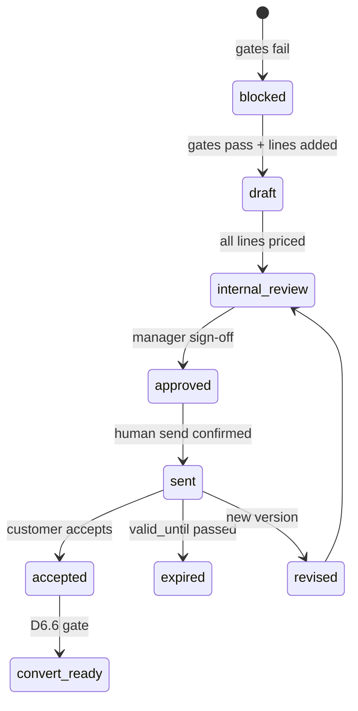

# D6.1 Quote Schema & API Design Review

**Status:** Design review complete · **Not implemented** · **Date:** 2026-05-23  
**Phase:** 2 · **Stage:** D6.1  
**Prerequisite:** D5 closed · Quote Input Contract available

---

## 1. Review Purpose

Define the **Customer Quote** system for intelliOffice Phase 2 MVP — schema, API surface, pricing rules, and safety boundaries — **without** database migration, model code, or live API implementation in this stage.

## 2. Executive Summary

| Decision | Recommendation |
|---|---|
| Domain name | **Customer Quote** (distinct from existing RFQ **Partner Quotation**) |
| Primary tables (proposed) | `customer_quotes`, `customer_quote_lines`, `customer_quote_versions`, `customer_quote_send_events` |
| Catalog / pricing (D6.2) | `product_skus`, `product_price_tiers`, `partner_price_lists`, `exchange_rates` |
| API namespace | **`/api/v1/quotes/*`** (v1 envelope per integrated backend standards) |
| Creation entry | Lead + D5 Quote Input Contract → manual create only |
| Multi-partner | One quote may contain lines from HOSUN, JOOBOO, and any other partner **as equals** |
| No price-less quote | If pricing unavailable, remain in D5 Pre-Quote / Quote Input Contract |
| AI role | **No AI-generated prices**; AI may assist copy/PDF layout only after prices are confirmed |

---

## 3. Terminology & Existing Model Mapping

The codebase already contains RFQ-domain objects. Phase 2 must **not** overload them.

| Concept | Existing table / API | Phase 2 Customer Quote |
|---|---|---|
| Customer inquiry bundle | `rfqs`, `rfq_items` | Optional link; quote may exist without RFQ |
| **Partner/supplier quote** | `quotations`, `quotation_items` (`/api/quotations`) | **Keep as-is** — internal procurement comparison |
| **Customer-facing quote** | *None* | **New** `customer_quotes` — what customer receives |
| Product master | `products`, `product_partner_links` | Extend via catalog/SKU (D6.2) |
| Order | `orders.quotation_id` → partner quotation | Future: `orders.customer_quote_id` (D6.6) |

**Naming rule:** In UI and docs, use **Partner Quotation** for `quotations` and **Customer Quote** (or **Sales Quote**) for the new module. Avoid ambiguous "quote" without qualifier.

---

## 4. Business Constraints (Design Must Enforce)

1. **intelliOffice** is platform / service provider — not a single-factory brand.
2. **HOSUN, JOOBOO, 重庆汇聚, future partners** are **equal** `manufacturing_partners` rows.
3. A single Customer Quote may mix lines from multiple partners.
4. Every line requires: `manufacturing_partner_id`, product name, category, SKU or temp SKU.
5. **No Customer Quote without priced lines** — gate creation on pricing source validation.
6. **Price sources allowed:** product catalog, cost model, uploaded/maintained price list, manual entry, confirmed pricing engine.
7. **Price sources forbidden:** AI inference, D5 derived estimates, product_fit scores, opportunity scores.
8. **Send:** human confirmation required; no auto-send.
9. **Convert to order:** human confirmation required; no auto-convert.
10. **No promises** in generated PDF unless explicitly entered and reviewed: inventory, certification, lead time.

---

## 5. D5 → Customer Quote Creation Gate

Customer Quote creation is allowed only when:

| Gate | Rule |
|---|---|
| D5 readiness | `quote_module_readiness` ∈ `{ ready_for_phase2_quote_draft }` OR operator override with documented reason |
| Contact | `contact_method_available = true` or explicit contact selected |
| Requirements | Critical `missing_requirements` resolved (quantity, product type, delivery location — configurable checklist) |
| Pricing | **Every line** has `unit_sell_price` from allowed source; no null sell price at `draft` → `internal_review` transition |
| Safety | D5 `safety.*` flags remain false; quote module sets its own audit flags separately |

If gates fail → operator stays in **Quote Input Contract / Pre-Quote** (D5).

### Proposed intake payload

```json
{
  "lead_id": "uuid",
  "quote_input_contract_snapshot": { "...": "immutable copy at creation time" },
  "company_id": "uuid",
  "contact_id": "uuid",
  "currency": "USD",
  "incoterm": "FOB",
  "price_mode": "FOB",
  "valid_until": "2026-06-30",
  "lines": []
}
```

`quote_input_contract_snapshot` is stored JSONB for audit — not re-fetched silently on edit.

---

## 6. Proposed Schema (Review Only — No Migration)

### 6.1 `customer_quotes`

| Column | Type | Notes |
|---|---|---|
| `id` | UUID PK | |
| `quote_number` | string unique | e.g. `CQ-20260523-0001` |
| `version` | int | starts at 1; increment on revision |
| `status` | enum | see §7 |
| `lead_id` | UUID FK nullable | source lead |
| `company_id` | UUID FK | customer company |
| `contact_id` | UUID FK nullable | |
| `rfq_id` | UUID FK nullable | optional link to RFQ |
| `owner_user_id` | UUID FK | |
| `quote_input_contract_snapshot` | JSONB | frozen D5 handoff |
| `currency` | string(3) | default `USD` |
| `incoterm` | enum | FOB, DDP, EXW, … |
| `price_mode` | enum | mirrors incoterm pricing basis |
| `exchange_rate_usd_cny` | numeric nullable | snapshot at quote lock |
| `exchange_rate_date` | date nullable | |
| `subtotal` | numeric | computed |
| `discount_amount` | numeric | |
| `shipping_cost` | numeric | |
| `sample_fee` | numeric | |
| `tax_amount` | numeric | |
| `total_amount` | numeric | |
| `internal_notes` | text | never on customer PDF |
| `customer_notes` | text | may appear on PDF |
| `valid_until` | date | |
| `sent_at` | timestamptz nullable | |
| `sent_by_user_id` | UUID nullable | |
| `accepted_at` | timestamptz nullable | |
| `converted_to_order_id` | UUID nullable | D6.6 |
| `pricing_confirmed_at` | timestamptz | all lines priced |
| `pricing_confirmed_by_user_id` | UUID | |
| audit columns | | `created_at`, `updated_at`, `created_by_id`, … |

### 6.2 `customer_quote_lines`

| Column | Type | Notes |
|---|---|---|
| `id` | UUID PK | |
| `customer_quote_id` | UUID FK | |
| `line_number` | int | display order |
| `manufacturing_partner_id` | UUID FK | **required** — equal partner |
| `product_id` | UUID FK nullable | catalog product |
| `sku_id` | UUID FK nullable | D6.2 catalog SKU |
| `temp_sku_code` | string nullable | when catalog SKU absent |
| `product_name` | string | **required** |
| `product_category` | string | **required** |
| `description` | text | |
| `quantity` | int | **required** |
| `uom` | string | default `EA` |
| `unit_cost_rmb` | numeric nullable | internal |
| `unit_cost_usd` | numeric nullable | derived from RMB + rate |
| `unit_sell_price` | numeric | **required before send** |
| `extended_sell_price` | numeric | computed |
| `margin_percent` | numeric nullable | internal |
| `price_source` | enum | catalog, cost_model, price_list, manual, pricing_engine |
| `price_source_ref` | string nullable | SKU tier id, upload batch id, etc. |
| `incoterm` | string nullable | line override |
| `lead_time_note` | text nullable | **informational only** — not auto-promised |
| `certification_note` | text nullable | **informational only** |
| `inventory_note` | text nullable | **informational only** |

**Rule:** `unit_sell_price` must reference `price_source` ≠ `ai` (enum excludes AI).

### 6.3 `customer_quote_versions`

Immutable snapshot on each publish/revision:

| Column | Type | Notes |
|---|---|---|
| `id` | UUID PK | |
| `customer_quote_id` | UUID FK | |
| `version` | int | |
| `snapshot_json` | JSONB | full quote + lines at revision |
| `pdf_file_id` | UUID FK nullable | D6.4 |
| `created_by_user_id` | UUID | |
| `revision_reason` | text | |

### 6.4 `customer_quote_send_events`

| Column | Type | Notes |
|---|---|---|
| `id` | UUID PK | |
| `customer_quote_id` | UUID FK | |
| `version` | int | |
| `channel` | enum | email, manual_export, other |
| `sent_at` | timestamptz | |
| `sent_by_user_id` | UUID | human actor |
| `recipient_summary` | string | no raw PII in logs if redacted |
| `confirmation_ack` | bool | operator confirmed send |

### 6.5 D6.2 dependencies (referenced, not in D6.1 scope)

| Table | Purpose |
|---|---|
| `product_skus` | SKU code, partner, product, specs |
| `product_price_tiers` | qty breaks: min_qty, unit_price, currency, incoterm |
| `partner_price_lists` | uploaded/maintained price sheets metadata |
| `exchange_rates` | daily USD/CNY (manual entry or feed) |
| `pricing_engine_runs` | optional audited batch pricing (non-AI rules) |

---

## 7. Status Lifecycle



| Status | Meaning |
|---|---|
| `blocked` | Created from contract but missing pricing/requirements |
| `draft` | Editable; may have unpriced lines only if status stays draft |
| `internal_review` | All lines priced; awaiting internal approval |
| `approved` | Ready for customer PDF / send |
| `sent` | Human confirmed send recorded |
| `accepted` | Customer acceptance logged |
| `expired` | Past `valid_until` |
| `cancelled` | Voided |
| `superseded` | Replaced by newer version |

**Hard rule:** Transition `draft` → `internal_review` requires every line `unit_sell_price` NOT NULL and `price_source` valid.

---

## 8. Pricing Model (Design)

### 8.1 Allowed price derivation chain

```
product_price_tiers (catalog)
  → unit_sell_price + price_source=catalog

partner_price_list row
  → unit_cost_rmb → apply margin + exchange_rate → unit_sell_price

manual entry
  → operator enters unit_sell_price + price_source=manual + reason

cost_model (D6.2+)
  → unit_cost_rmb from BOM/labor rules → margin → sell price

pricing_engine (rules-based, audited)
  → batch job writes prices with run_id reference
```

### 8.2 Currency

| Field | Currency | Visibility |
|---|---|---|
| `unit_cost_rmb` | CNY | internal only |
| `unit_cost_usd` | USD | internal |
| `unit_sell_price` | USD (MVP) | customer quote |
| `exchange_rate_usd_cny` | rate | snapshot on quote lock |

Daily rate from `exchange_rates` table; operator may override with audit reason.

### 8.3 Incoterms / price modes (MVP)

| Mode | Customer sees | Cost basis |
|---|---|---|
| FOB | FOB port price | ex-factory + export prep |
| EXW | EXW factory | factory gate |
| DDP | Delivered duty paid | includes freight/duty estimate (manual line or header `shipping_cost`) |

### 8.4 Tier pricing

`product_price_tiers`: `(sku_id, min_qty, max_qty, unit_price, currency, incoterm, valid_from, valid_to)`

Line quantity selects tier at add-to-quote time; snapshot tier id on line as `price_source_ref`.

---

## 9. API Design Review (Proposed `/api/v1/quotes/*`)

All responses use v1 envelope. Auth: existing JWT + role checks.

### 9.1 Quote CRUD

| Method | Path | Description |
|---|---|---|
| POST | `/api/v1/quotes/from-lead/{lead_id}` | Create from lead + fetch/store Quote Input Contract snapshot |
| GET | `/api/v1/quotes` | List with filters (status, company, partner, date) |
| GET | `/api/v1/quotes/{quote_id}` | Detail + lines + version summary |
| PATCH | `/api/v1/quotes/{quote_id}` | Update header (draft only) |
| DELETE | `/api/v1/quotes/{quote_id}` | Soft-delete / cancel (draft only) |

### 9.2 Lines

| Method | Path | Description |
|---|---|---|
| POST | `/api/v1/quotes/{quote_id}/lines` | Add line (partner + SKU or temp SKU) |
| PATCH | `/api/v1/quotes/{quote_id}/lines/{line_id}` | Update qty, price, notes |
| DELETE | `/api/v1/quotes/{quote_id}/lines/{line_id}` | Remove line |
| POST | `/api/v1/quotes/{quote_id}/lines/{line_id}/apply-catalog-price` | Pull tier price from catalog (D6.2) |

### 9.3 Workflow

| Method | Path | Description |
|---|---|---|
| POST | `/api/v1/quotes/{quote_id}/submit-review` | draft → internal_review (validates all priced) |
| POST | `/api/v1/quotes/{quote_id}/approve` | internal_review → approved |
| POST | `/api/v1/quotes/{quote_id}/revise` | Create new version from approved/sent |
| POST | `/api/v1/quotes/{quote_id}/mark-sent` | **Human confirmed** send tracking |
| POST | `/api/v1/quotes/{quote_id}/mark-accepted` | Customer acceptance |
| GET | `/api/v1/quotes/{quote_id}/versions` | Version history |
| GET | `/api/v1/quotes/{quote_id}/versions/{version}/pdf` | PDF download (D6.4) |

### 9.4 Readiness helpers

| Method | Path | Description |
|---|---|---|
| GET | `/api/v1/quotes/readiness/from-lead/{lead_id}` | Wraps D5 contract + Phase 2 gate checklist |
| GET | `/api/v1/quotes/{quote_id}/convert-to-order-readiness` | D6.6 gate (no auto-convert) |

### 9.5 Explicit non-goals in API (D6.1)

- No `POST .../auto-price`
- No `POST .../auto-send`
- No `POST .../convert-to-order` without separate D6.6 approval endpoint
- No AI endpoints under `/api/v1/quotes/*`

---

## 10. UI Surfaces (Future — Design Reference)

| Surface | Route (proposed) | Stage |
|---|---|---|
| Quote list | `/quotes` | D6.3 |
| Quote builder | `/quotes/{id}` | D6.3 |
| Create from lead | `/lead-intelligence` → "Create Customer Quote" | D6.3 |
| PDF preview | Quote builder tab | D6.4 |
| Send confirmation modal | Quote builder | D6.5 |

Entry button on Lead Intelligence visible only when D5 + Phase 2 readiness gates pass.

---

## 11. Safety & Audit

| Flag / rule | Value |
|---|---|
| `automatic_sending_enabled` | always false at platform level for quotes |
| `pricing_generated_by_ai` | must not exist; use `price_source` enum without AI |
| PDF disclaimers | "Subject to confirmation" for lead time / certification unless explicit |
| Activity log | `customer_quote_created`, `line_priced`, `quote_sent`, `quote_accepted`, `convert_to_order_requested` |
| Portal | read-only quote summary in later portal module — not in D6.1 |

---

## 12. Phase 2 Sub-Roadmap

| Stage | Scope | Depends on |
|---|---|---|
| **D6.1** | Schema & API design review | D5 closed |
| **D6.2** | Product catalog & pricing foundation | D6.1 approved |
| **D6.3** | Quote builder MVP | D6.2 |
| **D6.4** | PDF export | D6.3 |
| **D6.5** | Versioning & send tracking | D6.3 |
| **D6.6** | Quote-to-order readiness gate | D6.5 |

---

## 13. Open Design Questions (For D6.2 Review)

1. **Quote number format** — global sequence vs per-year?
2. **Tax model** — US sales tax MVP vs manual `tax_amount` only?
3. **DDP freight** — single header shipping vs per-line freight?
4. **RFQ linkage** — required when RFQ exists, or always optional?
5. **Margin visibility** — role-based field masking in API responses?
6. **Existing `quotations` migration** — keep separate forever vs link partner quotation to customer quote line cost?

---

## 14. Review Verdict

| Criterion | Result |
|---|---|
| D5 boundary respected | ✅ Customer Quote is new domain object |
| Partner equality | ✅ Line-level partner binding, no brand hard-code |
| No AI pricing | ✅ Enforced in schema + API design |
| No price-less customer quote | ✅ Status gate |
| No auto-send / auto-order | ✅ Explicit human endpoints |
| Existing RFQ/Quotation preserved | ✅ Separate tables and APIs |
| Ready for D6.2 | ✅ Catalog/pricing tables scoped |

**D6.1 design review is approved to proceed to D6.2 implementation planning.**

---

## Related Documents

- [Phase 2 Quote Module Readiness Brief](quote_module_readiness_brief.md)
- [Phase 2 Roadmap](phase2_roadmap.md)
- [D5 Capability Map](../architecture/d5_capability_map.md)
- [D5.19 Quote Input Contract UAT](../records/d5_19_soft_quote_handoff_uat_quote_input_contract_20260523.md)
- [Integrated Backend Standards](../integrated_backend_standards.md)
