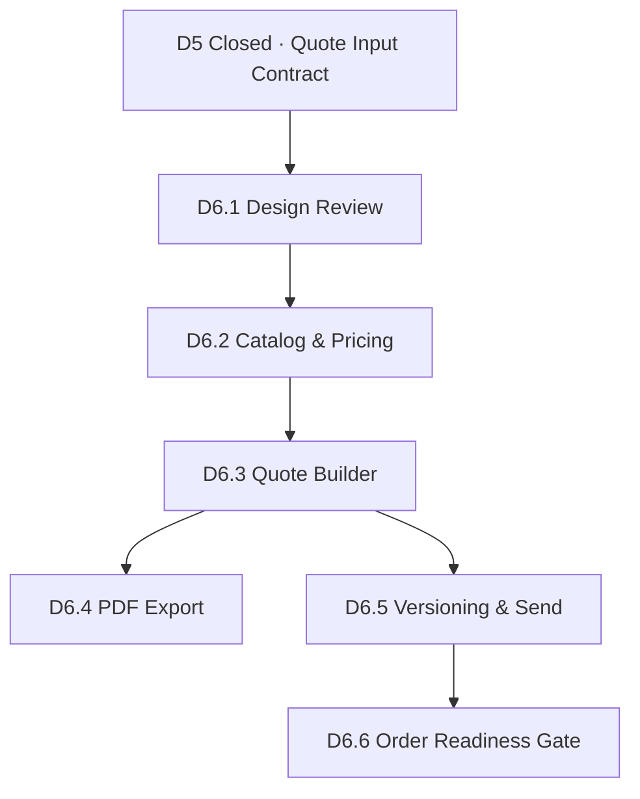

# Phase 2 Roadmap

**Status:** Active planning · **D5 closed** · **Date:** 2026-05-23

Phase 2 builds the formal **Customer Quote** system for intelliOffice. It does **not** include production or shipment in MVP scope.

---

## Principles

1. **Customer Quote ≠ Partner Quotation** — existing `quotations` table remains RFQ supplier comparison; Phase 2 adds customer-facing quotes.
2. **D5 Quote Input Contract** is the mandatory handoff boundary from lead development.
3. **All partners equal** — HOSUN, JOOBOO, future factories bound per line, not as platform default.
4. **No AI pricing** — prices from catalog, cost model, price lists, manual entry, or audited pricing engine only.
5. **No price-less customer quote** — unpriced work stays in D5.
6. **Human send, human convert** — no automation for customer delivery or order creation.

---

## Stages

| Stage | Name | Deliverables | Implementation |
|---|---|---|---|
| **D6.1** | Quote Schema & API Design Review | Excel pricing extraction, full schema, API, PDF, permissions | **Design only** ✅ |
| **D6.2** | Product Catalog & Pricing Foundation | catalog, tiers, FX, pricing preview, seed/import | **Implemented** ✅ |
| **D6.2.1** | Excel Pricing Import Alignment | parser alignment to real workbook | **Implemented** ✅ |
| **D6.3** | Quote CRUD & Versioning | quotes, lines, totals, versions, mark-sent | **Implemented** ✅ |
| **D6.3** | Quote Builder MVP | Create from lead, multi-partner lines | DB + API + UI |
| **D6.4** | Quote PDF Export | Customer PDF, export metadata, download | **Implemented** ✅ |
| **D6.5** | Quote Send Tracking & Delivery Log | delivery logs, timeline, follow-up | **Implemented** ✅ |
| **D6.6** | Quote-to-Order Readiness Gate | readiness checklist, order input contract | **Implemented** ✅ |

**Out of scope (Phase 2 MVP):** production milestones, shipment tracking, inventory reservation, automatic email/LinkedIn send.

---

## Dependency Graph

---

## MVP Capability Checklist (End of D6.5)

- [ ] Create Customer Quote from lead + Quote Input Contract snapshot
- [ ] Add lines from catalog or manual temp SKU
- [ ] Multi-partner lines in one quote
- [ ] Tier pricing from catalog
- [ ] FOB / EXW / DDP price modes
- [ ] USD sell price + RMB cost + daily exchange rate
- [ ] Internal margin visibility
- [ ] Discount, shipping, sample fee, tax on header
- [ ] Quote versioning
- [ ] PDF export
- [ ] Send tracking (human confirmed)
- [ ] No AI pricing, no auto-send

---

## Related Documents

- [D6.1 Quote Schema & API Design Review](d6_1_quote_schema_api_design_review.md)
- [Quote Module Readiness Brief](quote_module_readiness_brief.md)
- [D5 Final MVP Release](../releases/d5_final_mvp_release_20260523.md)
