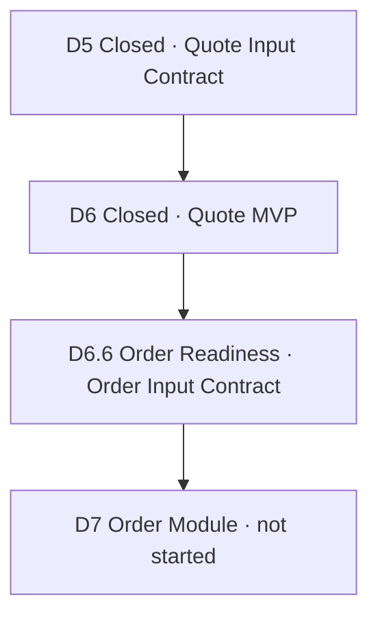

# Phase 2 Roadmap

**Status:** D6 closed · D7 planning · **Date:** 2026-05-23

Phase 2 delivered the **Customer Quote MVP** (D6). **Order / Production / Shipment** begins in D7.

---

## Principles

1. **Customer Quote ≠ Partner Quotation** — existing `quotations` table remains RFQ supplier comparison; D6 customer quotes are separate.
2. **D5 Quote Input Contract** was the mandatory handoff boundary from lead development.
3. **D6 Order Input Contract** is the mandatory handoff boundary to D7 order planning.
4. **All partners equal** — HOSUN, JOOBOO, future factories bound per line, not as platform default.
5. **No AI pricing** — prices from catalog, cost model, price lists, manual entry, or audited pricing engine only.
6. **Human send, human convert** — no automation for customer delivery or order creation.

---

## D6 Stages (Closed)

| Stage | Name | Status |
|---|---|---|
| **D6.1** | Quote Schema & API Design Review | ✅ Design |
| **D6.2** | Product Catalog & Pricing Foundation | ✅ Implemented |
| **D6.2.1** | Excel Pricing Import Alignment | ✅ Implemented |
| **D6.3** | Quote CRUD & Versioning | ✅ Implemented |
| **D6.4** | Quote PDF Export | ✅ Implemented |
| **D6.5** | Quote Send Tracking & Delivery Log | ✅ Implemented |
| **D6.6** | Quote-to-Order Readiness Gate | ✅ Implemented |
| **D6.7** | Quote MVP Closure & D7 Readiness Gate | ✅ Closed |

**D6 does not include:** production milestones, shipment tracking, inventory reservation, automatic email/LinkedIn send, order records.

---

## D7 Stages (Planning — D7.1 design complete)

| Stage | Name | Status |
|---|---|---|
| **D7.1** | Order Schema & API Design Review | ✅ Design complete |
| **D7.2** | Order CRUD MVP | Planned |
| **D7.3** | Customer Confirmation Flow | Planned |
| **D7.4** | Partner Split & Supplier Confirmation | Planned |
| **D7.5** | Production Milestone Foundation | Planned |
| **D7.6** | Shipment Tracking Foundation | Planned |
| **D7.7** | Customer Order Status View | Future |

See [Phase 3 Roadmap](../phase3/phase3_roadmap.md) · [D7.1 Design Review](../phase3/d7_1_order_schema_api_design_review.md).

---

## Dependency Graph

---

## MVP Capability Checklist (D6 Final)

- [x] Product catalog with partner binding
- [x] Tier pricing from catalog
- [x] FX rates and pricing preview
- [x] Excel pricing import (CLI)
- [x] Create Customer Quote from lead + Quote Input Contract snapshot
- [x] Quote line items and adjustments
- [x] Quote totals
- [x] Quote versioning
- [x] PDF export (MVP layout)
- [x] Send tracking (human confirmed)
- [x] Delivery log and timeline
- [x] Order readiness gate (no order creation)
- [x] No AI pricing, no auto-send

---

## Related Documents

- [D6 Final Release](../releases/d6_final_quote_mvp_release_20260523.md)
- [D6 Capability Map](../architecture/d6_quote_capability_map.md)
- [D6 Final Closure Record](../records/d6_final_closure_20260523.md)
- [D7 Order Module Readiness Brief](../phase3/d7_order_module_readiness_brief.md)
- [D7.1 Order Schema & API Design Review](../phase3/d7_1_order_schema_api_design_review.md)
- [Phase 3 Roadmap](../phase3/phase3_roadmap.md)
- [D6.1 Quote Schema & API Design Review](d6_1_quote_schema_api_design_review.md)
- [Quote Module Readiness Brief](quote_module_readiness_brief.md)
- [D5 Final MVP Release](../releases/d5_final_mvp_release_20260523.md)
