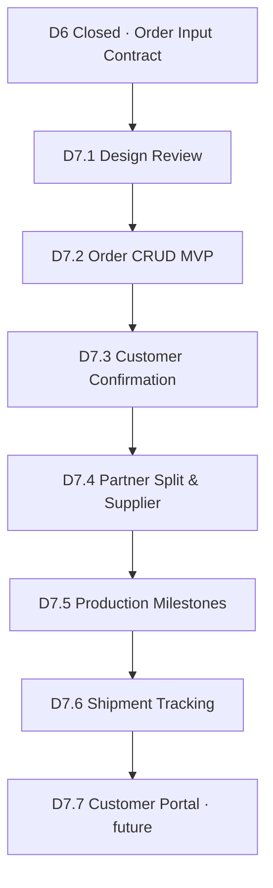

# Phase 3 Roadmap — Order / Production / Shipment

**Status:** D7.2 implemented · **D6 closed** · **Date:** 2026-05-23

Phase 3 builds the **Customer Order** module and downstream production/shipment foundations. D6 Quote MVP remains frozen.

---

## Principles

1. **Quote ≠ Order** — orders created manually from Order Input Contract
2. **Customer confirmation required** before supplier/production stages
3. **All partners equal** — multi-partner splits, no platform default factory
4. **No auto-send** — no email/LinkedIn/Outlook automation in D7 MVP
5. **No auto production / shipment / payment** — all explicit human actions
6. **Structured handoff** — consume D6 JSON contract, not PDF parsing

---

## Stages

| Stage | Name | Scope | Status |
|---|---|---|---|
| **D7.1** | Order Schema & API Design Review | Data model, lifecycle, API, permissions, safety | ✅ **Design complete** |
| **D7.2** | Order CRUD MVP | `customer_orders`, `order_line_items`, from-quote API, list/detail/cancel | ✅ **Implemented** |
| **D7.3** | Customer Confirmation Flow | `order_confirmations`, add/list/void, timeline | ✅ **Implemented** |
| **D7.4** | Partner Split & Supplier Confirmation | `order_partner_splits`, `supplier_confirmations` | Planned |
| **D7.5** | Production Milestone Foundation | `production_milestones`, milestone API | Planned |
| **D7.6** | Shipment Tracking Foundation | `shipment_plans`, shipment API | Planned |
| **D7.7** | Customer Order Status View | Customer portal read-only status | Future |

---

## Dependency Graph

---

## D7.2 MVP Checklist

- [x] Migration: `customer_orders`, `order_line_items`
- [x] `POST /api/v1/orders/from-quote`
- [x] Order list, detail, patch, cancel
- [x] Order timeline
- [x] Source quote linkage (read-only)
- [x] Safety flags on all responses
- [x] Frontend `/orders` pages
- [x] No production / shipment / payment

---

## Out of Scope (Phase 3 MVP)

- Automatic email / LinkedIn / Outlook
- Payment processing
- Invoice generation
- Customer portal (until D7.7)
- Inventory reservation system
- Factory MES integration
- PDF parsing for order creation

---

## Related Documents

- [D7.2 Order CRUD MVP](d7_2_order_crud_mvp.md)
- [D7.1 Order Schema & API Design Review](d7_1_order_schema_api_design_review.md)
- [D7 Order Module Readiness Brief](d7_order_module_readiness_brief.md)
- [D6 Final Release](../releases/d6_final_quote_mvp_release_20260523.md)
- [D6 Capability Map](../architecture/d6_quote_capability_map.md)
- [Phase 2 Roadmap](../phase2/phase2_roadmap.md)
