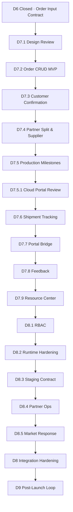

# Phase 3 Roadmap — Order / Production / Shipment

**Status:** D8 integration hardening foundation implemented / **D6 closed** / **Date:** 2026-05-29

Phase 3 builds the **Customer Order** module and downstream production/shipment foundations. D6 Quote MVP remains frozen.

---

## Principles

1. **Quote ≠ Order** — orders created manually from Order Input Contract
2. **Customer confirmation required** before supplier/production stages
3. **All partners equal** — multi-partner splits, no platform default factory
4. **No auto-send** — no email/LinkedIn/Outlook automation in D7 MVP
5. **No auto production / shipment / payment** — all explicit human actions
6. **Structured handoff** — consume D6 JSON contract, not PDF parsing

---

## Stages

| Stage | Name | Scope | Status |
|---|---|---|---|
| **D7.1** | Order Schema & API Design Review | Data model, lifecycle, API, permissions, safety | ✅ **Design complete** |
| **D7.2** | Order CRUD MVP | `customer_orders`, `order_line_items`, from-quote API, list/detail/cancel | ✅ **Implemented** |
| **D7.3** | Customer Confirmation Flow | `order_confirmations`, add/list/void, timeline | ✅ **Implemented** |
| **D7.4** | Partner Split & Supplier Confirmation | `order_partner_splits`, `supplier_confirmations` | ✅ **Implemented** |
| **D7.5** | Production Milestone Foundation | `order_production_milestones`, milestone API | ✅ **Implemented** |
| **D7.5.1** | Existing Cloud Portal Integration Review | Mapping, architecture, API boundary (no code) | ✅ **Review complete** |
| **D7.6** | Shipment Tracking Foundation | `shipment_plans`, shipment API | ✅ **Implemented** |
| **D7.7** | Customer Portal Bridge | `/api/v1/portal/customer/*` read API + auth, `feedback_tickets` MVP | ✅ **Implemented** |
| **D7.8** | Service Portal UAT & Feedback Operations | consumer contract pack, staging readiness, feedback console | ✅ **Implemented** |
| **D7.9** | Resource Center | customer document catalog + signed download | ✅ **Implemented** |
| **D8.1** | RBAC / Scoped Access | role presets, route permission guards, `/auth/me` capabilities | Implemented |
| **D8.2** | Runtime Hardening | staging/local doctor, token and storage checks | Implemented |
| **D8.3** | Service Portal Staging | HTTP contract runner for service.intelli-opus.com integration | Contract runner implemented |
| **D8.4** | Multi-Partner Operations Dashboard | read-only partner workload, supplier, production, shipment risk view | Implemented |
| **D8.5** | Market Response Intelligence | feedback tags, win-loss signals, demand board, product gaps, advisory recommendations | Implemented |
| **D8** | Deployment & Integration Hardening | CORS, HTTPS, token/storage safety, cloud readiness gate, record redaction gate, production coordination plan | Evidence workflow added |
| **D9** | Post-Launch Operating Loop | production health review, order operations loop, market response loop, improvement backlog | Planned |

---

## Dependency Graph

---

## D7.2 MVP Checklist

- [x] Migration: `customer_orders`, `order_line_items`
- [x] `POST /api/v1/orders/from-quote`
- [x] Order list, detail, patch, cancel
- [x] Order timeline
- [x] Source quote linkage (read-only)
- [x] Safety flags on all responses
- [x] Frontend `/orders` pages
- [x] No production / shipment / payment

---

## Out of Scope (Phase 3 MVP)

- Automatic email / LinkedIn / Outlook
- Payment processing
- Invoice generation
- Customer portal UI replacement (retain existing cloud portal UI)
- Inventory reservation system
- Factory MES integration
- PDF parsing for order creation

---

## Related Documents

- [D7.5.1 Existing Cloud Portal Integration Review](d7_5_1_existing_cloud_portal_integration_review.md)
- [D7.6 Shipment Tracking Foundation](d7_6_shipment_tracking_foundation.md)
- [D7.7 Customer Portal Bridge API](d7_7_customer_portal_bridge_api.md)
- [D7.9 Resource Center](d7_9_resource_center.md)
- [D8.1 RBAC and Scoped Access](d8_1_rbac_scoped_access.md)
- [D8.2 Runtime Hardening](d8_2_runtime_hardening.md)
- [D8.3 Service Portal Staging Integration](d8_3_service_portal_staging_integration.md)
- [D8.4 Multi-Partner Operations Dashboard](d8_4_multi_partner_operations_dashboard.md)
- [D8.5 Market Response Intelligence](d8_5_market_response_intelligence.md)
- [D8 Integration Hardening](d8_integration_hardening.md)
- [D8 Strict Staging / Cloud Validation](d8_strict_staging_cloud_validation.md)
- [D8 Local Staging Rehearsal](d8_local_staging_rehearsal.md)
- [D8 Delivery Stage Goal Matrix](d8_delivery_stage_goal_matrix.md)
- [D8 Readiness Audit](d8_readiness_audit.md)
- [D8 Staging Operator Handoff](d8_staging_operator_handoff.md)
- [D8 Staging Execution Pack](d8_staging_execution_pack.md)
- [D8 Staging Handoff Bundle](d8_staging_handoff_bundle.md)
- [D8 Staging Input Preflight](d8_staging_input_preflight.md)
- [D8 Staging Access Request](d8_staging_access_request.md)
- [D8 Staging Operator Response Intake](d8_staging_operator_response_intake.md)
- [D8 Staging Gap Triage](d8_staging_gap_triage.md)
- [D8 Staging Records Policy](d8_staging_records_policy.md)
- [D8 Staging Evidence Review](d8_staging_evidence_review.md)
- [D8 Production Coordination Plan](d8_production_coordination_plan.md)
- [D9 Post-Launch Operating Loop](d9_post_launch_operating_loop.md)
- [D9 Operating Loop Kickoff](d9_operating_loop_kickoff.md)
- [D9 Operating Records Policy](d9_operating_records_policy.md)
- [Project Execution Chain Gate](project_execution_chain_gate.md)
- [Project Execution Acceptance Audit](project_execution_acceptance_audit.md)
- [IE Auto Project Plan](ie_auto_project_plan.md)
- [D7.2 Order CRUD MVP](d7_2_order_crud_mvp.md)
- [D7.1 Order Schema & API Design Review](d7_1_order_schema_api_design_review.md)
- [D7 Order Module Readiness Brief](d7_order_module_readiness_brief.md)
- [D6 Final Release](../releases/d6_final_quote_mvp_release_20260523.md)
- [D6 Capability Map](../architecture/d6_quote_capability_map.md)
- [Phase 2 Roadmap](../phase2/phase2_roadmap.md)
