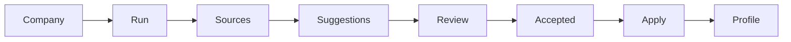

# Public-Source Enrichment MVP（D5.2）

## 1. 目标

在 **不** 替代人工判断、**不** 静默覆盖正式 CRM 事实的前提下，利用 **公司官网等有限公开页** 抽取 **可引用证据**，生成 **待审阅建议**（业务摘要草稿、标签、market fit segments、规则评分候选），支撑 A 域 Lead Intelligence 的 **半自动 enrichment**。

与「普通营销爬虫 / 通用网站摘要器」的区别：

- **Evidence-first**：每条建议尽量绑定来源 URL、摘录、匹配理由与抓取时间；系统应对「为什么这样建议」作出可审计说明。
- **Human-in-the-loop**：默认 **pending**；仅 **accepted** 后可通过显式 **apply** 写入公司正式字段或 `Tag`；**rejected** 记录 **保留**，避免重复误判无迹可循。
- **升降系统主轴**：规则与 D5/D5.1 共用 [`intelligence_score.py`](../backend/app/services/a_domain/intelligence_score.py) 与 segment 语义；**无** partner 名称偏置。

## 2. 当前流程（MVP）

- **Company**：必须配置 `website` 作为抓取种子。
- **Enrichment Run**：一次任务；状态 `pending` → `running` → `completed` / `failed`。
- **Source / Evidence**：每行对应一次有限 HTTP 抓取（标题、正文摘录、hash、HTTP 状态等）。
- **Suggestions**：`business_summary` / `tag` / `market_segment` / `score_hint`。
- **Review**：单条或批量 `accepted` / `rejected`；`partial` 在本 MVP 中等价于带编辑的接受路径（见 API）。
- **Apply**：仅对已 **accepted** 的建议执行写回（见下）。

## 3. 当前来源范围

从 `website` 推导 origin，**仅**尝试固定路径（不搜索引擎、不站外漫游）：

- `/`（root）
- `/about`
- `/products`
- `/services`
- `/solutions`
- `/contact`

约束：**同源主机名**（`www` 剥离后一致）、**SSRF 防护**（阻断 obvious 内网/本地主机名）、**每页超时**、**响应体与文本长度上限**、**默认最大页数**（见 `Settings.ENRICHMENT_*`）。

## 4. 当前 suggestion 类型

| 类型 | 说明 |
|------|------|
| `business_summary` | 规则拼装的摘要 **草稿**（非 LLM 默认路径） |
| `tag` | 建议正式 `Tag` 名（如 `height_adjustable_desk`） |
| `market_segment` | 与 D5 segments 对齐的 slug 建议 |
| `score_hint` | `IntelligenceScoreResult` 的 JSON 候选（**非**正式 Lead 分） |

## 5. 为什么必须 evidence-first

- 公开页可能过时、噪声大或仅为品牌宣传；**不得**等同人工核实的事实。
- 正式画像字段与 `ObjectTag` 仍为 **唯一可信层**；enrichment 仅为 **建议层**。

## 6. Accepted facts 应用策略（MVP）

| 类型 | Apply 行为 |
|------|----------------|
| `tag` | `get_or_create` `Tag`，挂 `ObjectTag(company)` |
| `business_summary` | 写入 `Company.business_description` |
| `market_segment` | 将 segment slug **合并**进 `product_interest_tags`（CSV 去重） |
| `score_hint` | 写入 `Note`（公司对象），明确标注「非正式评分」 |

所有 apply 均写 **activity log**。

## 7. API 概要

- `POST /api/companies/{company_id}/enrichment/runs`
- `GET /api/companies/{company_id}/enrichment/runs`
- `GET /api/companies/enrichment/runs/{run_id}`
- `POST /api/companies/enrichment/suggestions/{id}/review`
- `POST /api/companies/enrichment/runs/{run_id}/suggestions/batch-review`
- `POST /api/companies/{company_id}/enrichment/suggestions/{id}/apply`

禁用外网：`PUBLIC_ENRICHMENT_ENABLED=false` → `POST .../runs` 返回 **403**。

## 8. 当前不做什么

- 大规模通用爬虫、搜索收录、无限深度爬站  
- LinkedIn / 邮件自动外联 / Campaign 自动执行  
- RFQ / 报价 / 订单全链  
- 复杂 AI Agent 全自动决策  
- **任何** partner 名称特权或默认「主厂」叙事  

## 9. 前端

公司详情页嵌 **「公开来源 Enrichment」** 卡片：启动 run、查看最近状态、抽屉内审阅来源与建议、接受/拒绝/批量、对已接受项 **写入正式画像**。

## 10. 后续演进（非本阶段承诺）

- 批量公司 enrichment、基于搜索的公司发现  
- 目录 / Maps / import 记录  
- 更强 AI 辅助分类（仍保持 evidence + 人审）  
- Campaign 集成、与 B/C/D 域深链  
- 基于 **capability / category** 的伙伴匹配（非按单一厂牌）

## 相关文档

- [lead_intelligence_mvp.md](lead_intelligence_mvp.md)  
- [migration_from_web_to_desktop.md](migration_from_web_to_desktop.md)  
- [roadmap_desktop_transition.md](roadmap_desktop_transition.md)
